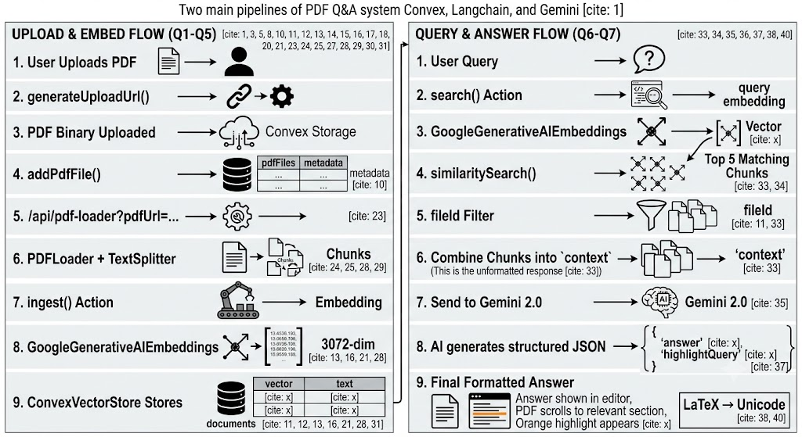
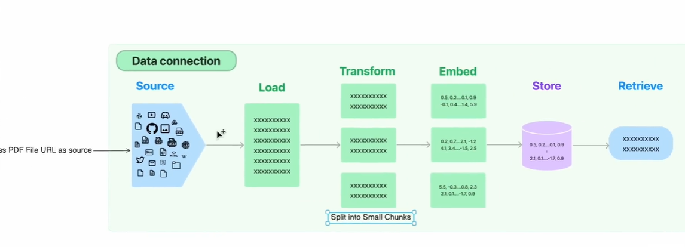

# NoteAG Implementation Guide
## Building a PDF + AI Q&A SaaS with Convex, Langchain & Gemini

---

## 📖 How NoteAG Works: A Visual Explanation

Before jumping into code, let's understand the complete system through diagrams and real examples.

### What You're Looking At


*The NoteAG interface: PDF viewer on the left, AI-powered text editor on the right*

This is NoteAG in action. A user uploads a PDF document, asks questions about it, and gets intelligent answers with the exact source highlighted in the PDF. But how does this magic happen? Let's break it down.

---

### The Two-Pipeline Architecture


*Two main flows: Upload & Embed (left) and Query & Answer (right)*

NoteAG works using **two separate pipelines**:

#### **Left Side: UPLOAD & EMBED FLOW** (Happens once when PDF is uploaded)
This is the "setup" phase that prepares your PDF for intelligent searching:

1. **User Uploads PDF** → File selected from computer
2. **generateUploadUrl()** → Convex creates a secure upload link
3. **PDF Binary Uploaded** → File stored in Convex Storage (cloud storage)
4. **addPdfFile()** → Saves file metadata (name, URL, owner) to database
5. **/api/pdf-loader** → API extracts all text from the PDF
6. **PDFLoader + TextSplitter** → Breaks text into small ~1000 character chunks
7. **ingest() Action** → Sends chunks for processing
8. **GoogleGenerativeAIEmbeddings** → Converts each chunk into a 3072-number vector (captures meaning)
9. **ConvexVectorStore Stores** → Saves vectors in `documents` table for searching

**Result:** Your PDF is now "searchable by meaning" not just keywords!

#### **Right Side: QUERY & ANSWER FLOW** (Happens every time user asks a question)
This is the "search and answer" phase:

1. **User Query** → Types question in text editor
2. **search() Action** → Triggered when AI button clicked
3. **GoogleGenerativeAIEmbeddings** → Converts question into same 3072-number format
4. **similaritySearch()** → Finds 5 most similar chunks by comparing vectors
5. **fileId Filter** → Only returns chunks from this specific PDF
6. **Combine Chunks into 'context'** → Merges 5 chunks into single text (unformatted response)
7. **Send to Gemini 2.0** → AI reads context + question
8. **AI generates structured JSON** → Returns `{"answer": "...", "highlightQuery": "..."}`
9. **Final Formatted Answer** → Answer inserted in editor, PDF highlights source, LaTeX converted to Unicode

**Result:** User sees a clean answer AND the exact PDF location where it came from!

---

### The LangChain Data Pipeline


*Standard data flow: Source → Load → Transform → Embed → Store → Retrieve*

This diagram shows the **industry-standard approach** for building AI document systems:

- **Source**: Your PDF file URL
- **Load**: Extract text using PDFLoader
- **Transform**: Split into small chunks (with overlap to preserve context)
- **Embed**: Convert chunks to vectors (numbers that represent meaning)
- **Store**: Save vectors in database with metadata
- **Retrieve**: Search vectors when user asks questions

**Why this matters:** This pipeline works for ANY document type (PDFs, websites, Word docs). Just swap the loader!

---

### What's Actually Stored in the Database


*Real Convex dashboard showing the documents table with embeddings*

Let's look at what's actually saved in Convex:

**The `documents` table has 3 columns:**

1. **embedding** → Array of 3072 numbers like `[0.00852593943, 0.017...]`
   - These numbers capture the *meaning* of the text
   - Similar meanings = similar numbers
   - Enables "semantic search" (searches by meaning, not keywords)

2. **metadata** → JSON object like `{ "fileId": "692ccd67-11de-43fd-..." }`
   - Links each chunk back to its original PDF
   - Allows filtering results by file

3. **text** → The actual text content
   - Example: "of their home. Since the da..."
   - This is what gets shown to the AI and highlighted in the PDF

**In this screenshot:** 12 documents (chunks) are stored from one uploaded PDF. When a user asks a question, Convex searches through ALL embeddings to find the 5 most relevant chunks.

---

### Key Concepts in Simple Terms

| What | How It Works | Why It's Powerful |
|------|-------------|-------------------|
| **Vector Embeddings** | Text converted to 3072 numbers that capture meaning | Can find "internship at Infosys" even when you search "Where did Arijit work?" |
| **Semantic Search** | Compares meanings, not exact words | Works across synonyms, paraphrasing, different languages |
| **Chunks** | Breaking text into ~1000 character pieces | Small = precise search. Overlap = no lost context |
| **RAG (Retrieval-Augmented Generation)** | Search first, then let AI read and answer | Accurate (cites source) + Clear (AI-written) |
| **Vector Store** | Database optimized for finding similar vectors | Can search millions of vectors in milliseconds |
| **HNSW Index** | Graph structure connecting similar vectors | Makes search super fast (like Google for meanings) |

---

### Real-World Example: Complete Flow

**Scenario:** Student uploads "Machine Learning Textbook.pdf" and asks: *"What is the formula for accuracy?"*

**Phase 1: Upload (30 seconds, happens once)**
```
PDF uploaded (200 pages) 
  → Stored in Convex Storage
  → Text extracted: 180,000 characters
  → Split into 150 chunks (~1,200 chars each)
  → Each chunk → Gemini → 3072-number vector
  → 150 vectors stored in documents table
  ✅ PDF ready for questions
```

**Phase 2: Query (2 seconds, happens every question)**
```
Question: "What is the formula for accuracy?"
  → Question → Gemini → [0.22, -0.08, 0.41, ...]
  → Compare against all 150 stored vectors
  → Top 5 matches found:
     • Row 87: 98% match → "Accuracy = (TP+TN)/(TP+TN+FP+FN)"
     • Row 88: 94% match → "True Positives (TP) are..."
     • Row 12: 87% match → "Performance metrics..."
     • Row 45: 82% match → "Confusion matrix..."
     • Row 99: 79% match → "Accuracy can be misleading..."
  → 5 chunks sent to Gemini 2.0 with question
  → AI reads and responds:
     {
       "answer": "Accuracy = (TP+TN)/(TP+TN+FP+FN)...",
       "highlightQuery": "Accuracy = (TP+TN)/(TP+TN+FP+FN)"
     }
  → Answer shown in editor
  → PDF scrolls to formula
  → Orange highlight appears
  ✅ Done in 2 seconds!
```

---

### Why This Approach Beats Traditional Search

**Traditional Keyword Search:**
```
Search: "Where did Arijit intern?"
Document: "...internship at Infosys Springboard..."
Result: ❌ No match (different words: "intern" vs "internship")
```

**NoteAG's Semantic Search:**
```
Search: "Where did Arijit intern?"
  → Vector: [0.21, -0.13, 0.89, ...]
Document: "...internship at Infosys Springboard..."
  → Vector: [0.23, -0.11, 0.91, ...]
Similarity: 98%
Result: ✅ FOUND! (similar meanings, different words)
```

**The Magic:** Vectors capture *meaning* not just words. "intern" and "internship" get similar vectors because they mean almost the same thing!

---

### Technology Stack Summary

- **Convex**: Database + File Storage + Vector Search (all-in-one backend)
- **LangChain**: Standardized pipeline for loading, splitting, embedding documents
- **Google Gemini**: Free AI for embeddings (3072 dimensions) + answer generation
- **Next.js**: React framework for the web interface
- **React-PDF**: Renders PDF with text layer for highlighting

---

Now that you understand **the complete system visually**, let's build it step-by-step with code!

---

## Table of Contents
1. [Setup Convex Database](#1-setup-convex-database)
2. [Store PDF Files in Convex](#2-store-pdf-files-in-convex)
3. [Split PDF Text into Chunks](#3-split-pdf-text-into-chunks-with-langchain)
4. [Generate Embeddings from Chunks](#4-generate-embeddings-from-chunks)
5. [Store Vectors in Convex Vector Store](#5-store-vectors-in-convex-vector-store)
6. [Retrieve Answer from Vector Store](#6-retrieve-answer-from-vector-store)
7. [Format Response with Gemini API](#7-format-response-with-gemini-api)

---

## 1. Setup Convex Database

### Step 1.1: Install Convex
```bash
npm install convex
npx convex dev
```

### Step 1.2: Create Schema (`convex/schema.js`)
Define your database tables with proper types and vector indexes:

```javascript
import { defineSchema, defineTable } from "convex/server";
import { v } from "convex/values";

export default defineSchema({
  // Users table
  users: defineTable({
    email: v.string(),
    imgUrl: v.string(),
    userName: v.string(),
  }),

  // PDF Files table - stores metadata about uploaded PDFs
  pdfFiles: defineTable({
    fileName: v.string(),
    fileUrl: v.string(),
    storageId: v.string(),
    createdBy: v.string(),
    fileId: v.string(),
    uploadedAt: v.string(),
  }),

  // Documents table - stores text chunks with embeddings
  documents: defineTable({
    embedding: v.array(v.number()),  // Vector embeddings
    text: v.string(),                 // Actual text chunk
    metadata: v.any(),                // Stores fileId and other metadata
  }).vectorIndex("byEmbedding", {
    vectorField: "embedding",
    dimensions: 3072,  // Gemini embedding-2 dimensions
  }),

  // Notes table - stores user notes per file
  notes: defineTable({
    fileId: v.string(),
    notes: v.string(),
    createdBy: v.string(),
  }),
});
```

**Key Points:**
- `pdfFiles` stores metadata (filename, URL, user email)
- `documents` stores the actual text chunks and their vector embeddings
- `vectorIndex` on `documents.embedding` enables similarity search
- `dimensions: 3072` matches Google's `gemini-embedding-2` model

---

## 2. Store PDF Files in Convex

### Step 2.1: Create File Storage Functions (`convex/fileStorage.js`)

```javascript
import { v } from "convex/values";
import { mutation, query } from "./_generated/server";

// Generate a temporary upload URL for client-side file upload
export const generateUploadUrl = mutation(async (ctx) => {
  return await ctx.storage.generateUploadUrl();
});

// Save PDF metadata after successful upload
export const addPdfFile = mutation({
  args: {
    fileName: v.string(),
    storageId: v.string(),
    createdBy: v.string(),
    fileId: v.string(),
  },
  handler: async (ctx, args) => {
    // Generate permanent, accessible URL from storageId
    const fileUrl = await ctx.storage.getUrl(args.storageId);

    await ctx.db.insert("pdfFiles", {
      fileName: args.fileName,
      fileUrl: fileUrl,  // Permanent read URL
      storageId: args.storageId,
      createdBy: args.createdBy,
      fileId: args.fileId,
      uploadedAt: new Date().toISOString(),
    });

    return { success: true, fileUrl };
  },
});

// Get all files for a specific user
export const getUserFiles = query({
  args: { userEmail: v.string() },
  handler: async (ctx, args) => {
    const files = await ctx.db
      .query("pdfFiles")
      .filter((q) => q.eq(q.field("createdBy"), args.userEmail))
      .collect();
    return files;
  },
});

// Get a single file by fileId
export const GetFileRecord = query({
  args: { fileId: v.string() },
  handler: async (ctx, args) => {
    const result = await ctx.db
      .query("pdfFiles")
      .filter((q) => q.eq(q.field("fileId"), args.fileId))
      .collect();
    return result[0];  // Return first match
  },
});
```

### Step 2.2: Frontend Upload Flow (Dashboard Component)

```javascript
// In your dashboard component
import { useMutation } from "convex/react";
import { api } from "../../convex/_generated/api";

const Dashboard = () => {
  const generateUploadUrl = useMutation(api.fileStorage.generateUploadUrl);
  const addPdfFile = useMutation(api.fileStorage.addPdfFile);

  const handleUpload = async (file, customName) => {
    try {
      // Step 1: Get temporary upload URL
      const uploadUrl = await generateUploadUrl();

      // Step 2: Upload file binary to Convex Storage
      const response = await fetch(uploadUrl, {
        method: "POST",
        headers: { "Content-Type": file.type },
        body: file,
      });
      const { storageId } = await response.json();

      // Step 3: Save metadata to database
      const fileId = crypto.randomUUID();
      const result = await addPdfFile({
        fileName: customName,
        storageId: storageId,
        createdBy: user.primaryEmailAddress.emailAddress,
        fileId: fileId,
      });

      console.log("✅ File uploaded:", result.fileUrl);
      
      // Step 4: Now call embedding pipeline
      await processAndEmbedPdf(result.fileUrl, fileId);
      
    } catch (error) {
      console.error("Upload failed:", error);
    }
  };
  
  // ... rest of component
};
```

**Flow Summary:**
1. **generateUploadUrl()** → Get temporary upload URL from Convex
2. **fetch(uploadUrl, POST)** → Upload PDF binary to Convex Storage
3. **addPdfFile()** → Save metadata (filename, URL, storageId) to database
4. **Result** → Permanent file URL like `https://your-app.convex.cloud/api/storage/xyz`

---

## 3. Split PDF Text into Chunks with Langchain

### Step 3.1: Install Dependencies
```bash
npm install @langchain/community @langchain/textsplitters pdf-parse
```

### Step 3.2: Create PDF Loader API Route (`src/app/api/pdf-loader/route.js`)

```javascript
import { NextResponse } from "next/server";
import { PDFLoader } from "@langchain/community/document_loaders/fs/pdf";
import { RecursiveCharacterTextSplitter } from "@langchain/textsplitters";

export async function GET(req) {
  const reqUrl = new URL(req.url);
  const pdfUrl = reqUrl.searchParams.get("pdfUrl");

  if (!pdfUrl) {
    return NextResponse.json({ error: "pdfUrl is required" }, { status: 400 });
  }

  try {
    // Step 1: Fetch PDF from Convex Storage URL
    const response = await fetch(pdfUrl);
    const data = await response.blob();

    // Step 2: Load PDF using Langchain PDFLoader
    const loader = new PDFLoader(data);
    const docs = await loader.load();

    // Step 3: Concatenate all pages into single text string
    let pdfTextContent = '';
    docs.forEach(doc => {
      pdfTextContent += doc.pageContent;
    });

    // Step 4: Split text into chunks using RecursiveCharacterTextSplitter
    const textSplitter = new RecursiveCharacterTextSplitter({
      chunkSize: 1000,      // Each chunk ~1000 characters (full paragraphs)
      chunkOverlap: 200,    // 200 char overlap to preserve context
    });

    const splitterList = await textSplitter.createDocuments([pdfTextContent]);

    // Step 5: Return array of text chunks
    return NextResponse.json({ 
      result: splitterList.map(doc => doc.pageContent)
    });
    
  } catch (error) {
    console.error("Error loading PDF:", error);
    return NextResponse.json({ 
      error: "Failed to load PDF content" 
    }, { status: 500 });
  }
}
```

### Step 3.3: Configure Next.js (`next.config.mjs`)

```javascript
/** @type {import('next').NextConfig} */
const nextConfig = {
  serverExternalPackages: ["pdfjs-dist", "pdf-parse"],
};

export default nextConfig;
```

**Why This Works:**
- `PDFLoader` parses PDF binary and extracts raw text
- `RecursiveCharacterTextSplitter` intelligently splits on sentence/paragraph boundaries
- `chunkSize: 1000` ensures each chunk has enough context for embeddings
- `chunkOverlap: 200` prevents important info from being cut at boundaries

---

## 4. Generate Embeddings from Chunks

### Step 4.1: Install Google Generative AI
```bash
npm install @langchain/google-genai @google/generative-ai
```

### Step 4.2: Set Google API Key in Convex
```bash
npx convex env set GOOGLE_API_KEY "AIzaSy..."
```

### Step 4.3: Create Embedding Action (`convex/myAction.js`)

```javascript
import { ConvexVectorStore } from "@langchain/community/vectorstores/convex";
import { action } from "./_generated/server.js";
import { GoogleGenerativeAIEmbeddings } from "@langchain/google-genai";
import { TaskType } from "@google/generative-ai";

// Ingest text chunks and generate embeddings
export const ingest = action({
  args: {
    splitText: v.array(v.string()),  // Array of text chunks
    fileId: v.string(),               // To associate chunks with PDF
  },
  handler: async (ctx, args) => {
    // Step 1: Create embedding model
    const embeddings = new GoogleGenerativeAIEmbeddings({
      apiKey: process.env.GOOGLE_API_KEY,
      model: "gemini-embedding-2",  // 3072 dimensions
      taskType: TaskType.RETRIEVAL_DOCUMENT,
    });

    // Step 2: Generate embeddings and store in Convex Vector Store
    await ConvexVectorStore.fromTexts(
      args.splitText,  // Text chunks
      args.splitText.map(() => ({ fileId: args.fileId })),  // Metadata
      embeddings,
      { ctx }
    );

    return "✅ Embeddings generated and stored";
  },
});
```

**What Happens:**
1. `GoogleGenerativeAIEmbeddings` creates embedding model
2. `TaskType.RETRIEVAL_DOCUMENT` tells Gemini to optimize for search
3. `ConvexVectorStore.fromTexts()` does 3 things:
   - Calls Google API to generate 3072-dim vector for each chunk
   - Stores vector in `documents` table
   - Attaches `fileId` metadata to track which PDF it came from

---

## 5. Store Vectors in Convex Vector Store

### How It Works Behind the Scenes

When you call `ConvexVectorStore.fromTexts()`, Langchain automatically:

```javascript
// What happens internally:
for (const text of splitText) {
  // Generate embedding vector from Google
  const embedding = await embeddings.embedDocuments([text]);
  
  // Store in Convex documents table
  await ctx.db.insert("documents", {
    text: text,
    embedding: embedding[0],  // 3072-dimensional array
    metadata: { fileId: fileId },
  });
}
```

**Vector Index Usage:**
The `vectorIndex("byEmbedding")` you defined in `schema.js` creates an HNSW (Hierarchical Navigable Small World) graph that enables:
- Fast similarity search (find nearest neighbors)
- Cosine distance calculation between query and stored vectors
- Efficient retrieval even with millions of vectors

---

## 6. Retrieve Answer from Vector Store

### Step 6.1: Create Search Action (`convex/myAction.js`)

```javascript
import { GoogleGenAI } from "@google/genai";

export const search = action({
  args: {
    query: v.string(),   // User's question
    fileId: v.string(),  // Which PDF to search
  },
  handler: async (ctx, args) => {
    // Step 1: Create embedding for the user's query
    const queryEmbeddings = new GoogleGenerativeAIEmbeddings({
      apiKey: process.env.GOOGLE_API_KEY,
      model: "gemini-embedding-2",
      taskType: TaskType.RETRIEVAL_QUERY,  // Different task type!
    });

    // Step 2: Initialize vector store
    const vectorStore = new ConvexVectorStore(queryEmbeddings, { ctx });

    // Step 3: Perform similarity search
    const results = await vectorStore.similaritySearch(args.query, 5);
    
    console.log("Retrieved chunks:", results.length);
    console.log("Unformatted result:", results);

    // Step 4: Filter results to match fileId
    const filteredResults = results.filter(
      (result) => result.metadata.fileId === args.fileId
    );

    // Step 5: Extract text from top chunks
    const context = filteredResults
      .map((result) => result.pageContent)
      .join("\n\n");

    console.log("Context sent to AI:", context);

    // Return unformatted chunks
    return {
      chunks: filteredResults.map(r => ({
        text: r.pageContent,
        metadata: r.metadata,
      })),
      context: context,
    };
  },
});
```

**Key Differences:**
- `TaskType.RETRIEVAL_QUERY` (for search) vs `RETRIEVAL_DOCUMENT` (for ingestion)
- `similaritySearch(query, 5)` returns 5 most similar chunks
- Cosine similarity is calculated between query vector and all stored vectors
- Results sorted by similarity score (closest first)

---

## 7. Format Response with Gemini API

### Step 7.1: Add RAG Generation to Search Action

```javascript
export const search = action({
  args: {
    query: v.string(),
    fileId: v.string(),
  },
  handler: async (ctx, args) => {
    // ... (Steps 1-5 from previous section: get context)

    // Step 6: Initialize Gemini for generation
    const ai = new GoogleGenAI({
      apiKey: process.env.GOOGLE_API_KEY,
    });

    // Step 7: Create professional RAG prompt
    const prompt = `You are a helpful AI assistant. A user has uploaded a PDF and asked a question.

Your task:
1. If the answer IS in the PDF context below, provide a clear, direct answer citing the document.
2. If the question is RELATED to the PDF topic but not explicitly answered, use your general knowledge and append "(from the web)" to your response.
3. If the question is COMPLETELY off-topic, respond: "❌ This information is not present in the provided PDF."

IMPORTANT: Extract a precise 4-8 word phrase from the context that directly proves your answer. This will be highlighted in the PDF.

PDF Context:
${context}

User Question: ${args.query}

Respond in JSON format:
{
  "answer": "your clear answer here",
  "highlightQuery": "exact phrase from PDF (4-8 words)"
}`;

    // Step 8: Call Gemini to generate answer
    const response = await ai.models.generateContent({
      model: "gemini-2.0-flash-thinking-exp-01-21",
      contents: [
        {
          role: "user",
          parts: [{ text: prompt }],
        },
      ],
    });

    // Step 9: Parse JSON response
    const aiText = response.response.text();
    const jsonMatch = aiText.match(/\{[\s\S]*\}/);
    const parsed = jsonMatch ? JSON.parse(jsonMatch[0]) : null;

    if (!parsed) {
      return {
        answer: "Too much traffic try after sometimes",
        sources: [],
      };
    }

    // Step 10: Clean LaTeX from answer (convert to Unicode)
    const cleanAnswer = convertLatexToUnicode(parsed.answer);

    console.log("AI Answer:", cleanAnswer);
    console.log("Highlight Query:", parsed.highlightQuery);

    return {
      answer: cleanAnswer,
      highlightQuery: parsed.highlightQuery,
      sources: filteredResults.map(r => r.pageContent),
    };
  },
});

// Helper: Convert LaTeX math to Unicode
function convertLatexToUnicode(text) {
  return text
    .replace(/\\\\/g, '\\')  // Normalize escaped backslashes
    .replace(/\$([^\$]+)\$/g, (match, latex) => {
      return latex
        .replace(/\\times/g, '×')
        .replace(/\\cdot/g, '·')
        .replace(/\\div/g, '÷')
        .replace(/\\sum/g, 'Σ')
        .replace(/\\int/g, '∫')
        .replace(/\\alpha/g, 'α')
        .replace(/\\beta/g, 'β')
        .replace(/\\hat\{([^}]+)\}/g, (m, c) => c + '\u0302')  // ŷ
        .replace(/_\{?(\d+)\}?/g, (m, n) => '₀₁₂₃₄₅₆₇₈₉'[n])  // Subscripts
        .replace(/\^\{?(\d+)\}?/g, (m, n) => '⁰¹²³⁴⁵⁶⁷⁸⁹'[n])  // Superscripts
        .replace(/\\text\{([^}]+)\}/g, '$1')
        .replace(/\\frac\{([^}]+)\}\{([^}]+)\}/g, '$1/$2')
        .replace(/[\\{}]/g, '');
    });
}
```

---

## Complete Flow Summary

### Frontend → Backend Pipeline

```
1. User uploads PDF
   ↓
2. Dashboard calls generateUploadUrl()
   ↓
3. PDF binary uploaded to Convex Storage
   ↓
4. addPdfFile() saves metadata
   ↓
5. Call /api/pdf-loader?pdfUrl=...
   ↓
6. PDFLoader + TextSplitter → chunks
   ↓
7. Call ingest() action with chunks
   ↓
8. GoogleGenerativeAIEmbeddings → vectors (3072-dim)
   ↓
9. ConvexVectorStore stores in documents table
   ↓
10. ✅ PDF ready for Q&A
```

### Query → Answer Pipeline

```
1. User selects text and clicks ✨ AI button
   ↓
2. Call search() action with query + fileId
   ↓
3. Generate query embedding with Gemini
   ↓
4. similaritySearch() finds top 5 matching chunks
   ↓
5. Filter chunks by fileId
   ↓
6. Combine chunks into context string
   ↓
7. Send context + query to Gemini 2.0
   ↓
8. AI generates structured JSON response
   ↓
9. Parse answer + highlightQuery
   ↓
10. Convert LaTeX to Unicode
   ↓
11. Insert answer into text editor
   ↓
12. Send highlightQuery to PDF viewer
   ↓
13. ✅ Answer shown + PDF highlighted
```

---

## Key Concepts Explained

### Why Vector Embeddings?
Traditional search (keyword matching) fails with semantic queries:
- Query: "Where did Arijit intern?"
- Document: "...internship at Infosys Springboard..."
- Keyword search: ❌ No match (different words)
- Vector search: ✅ Match! (semantic similarity)

Embeddings convert text → numbers that capture meaning:
```
"internship at Infosys" → [0.23, -0.15, 0.87, ..., 0.42]  (3072 numbers)
"Where did Arijit intern?" → [0.21, -0.13, 0.89, ..., 0.45]  (similar!)
```

### Why RAG (Retrieval-Augmented Generation)?
Pure vector search returns raw chunks:
```
❌ "My internship at Infosys Springboard gave me practical exposure..."
```

RAG = Vector Search + LLM:
```
✅ "Arijit completed his internship at Infosys Springboard, where he built EstateAI."
```

The LLM reads the chunks and synthesizes a clean, direct answer.

### Why Chunk Size 1000?
- Too small (100 chars): Breaks context, poor embeddings
- Too large (5000 chars): Exceeds embedding model limits, less precise
- 1000 chars: ~2-3 paragraphs, perfect balance

### Why Chunk Overlap 200?
Prevents splitting sentences in half:
```
Chunk 1: "...worked at Infosys"
Chunk 2: "Springboard where he built..."
❌ Lost context!
```

With overlap:
```
Chunk 1: "...worked at Infosys Springboard where..."
Chunk 2: "...at Infosys Springboard where he built..."
✅ Both chunks have full context!
```

---

## Testing Your Implementation

### Test 1: Upload and Embed
```javascript
// 1. Upload a PDF
const file = new File([pdfBlob], "test.pdf");
await handleUpload(file, "Test Document");

// 2. Check Convex Dashboard
// → documents table should have ~50-100 rows (depends on PDF size)
// → Each row has embedding: [3072 numbers]
```

### Test 2: Query and Retrieve
```javascript
// In browser console:
const result = await searchAction({
  query: "What is the main topic?",
  fileId: "your-file-id"
});

console.log(result.chunks);  // Should show 5 relevant chunks
```

### Test 3: End-to-End
1. Select text in editor: "What is machine learning?"
2. Click ✨ AI button
3. Check console:
   - `Retrieved chunks: 5`
   - `AI Answer: ...`
   - `Highlight Query: ...`
4. Verify:
   - Answer appears in editor
   - PDF scrolls to relevant section
   - Orange highlight appears

---

## Common Issues & Solutions

### Issue 1: Empty Embeddings (`[]`)
**Cause:** Wrong model or API key
**Fix:** Use `gemini-embedding-2`, verify key starts with `AIzaSy`

### Issue 2: No Highlighting in PDF
**Cause:** Text layer not rendered yet
**Fix:** Add retry polling (implemented in pdfViewer.js)

### Issue 3: Rate Limit (429 Error)
**Cause:** Free tier quota exhausted
**Fix:** Create new project in Google AI Studio for fresh quota

### Issue 4: LaTeX in Output (`$k \times k$`)
**Cause:** AI returning raw LaTeX
**Fix:** Use `convertLatexToUnicode()` function (provided above)

---

## Environment Variables Checklist

```bash
# Convex (get from dashboard.convex.dev)
CONVEX_DEPLOYMENT=...
NEXT_PUBLIC_CONVEX_URL=...

# Google AI (get from aistudio.google.com)
GOOGLE_API_KEY=AIzaSy...  # Set in Convex: npx convex env set

# Clerk Auth
NEXT_PUBLIC_CLERK_PUBLISHABLE_KEY=...
CLERK_SECRET_KEY=...
```

---

## Production Optimizations

### 1. Batch Embedding
Instead of embedding chunks one-by-one:
```javascript
const embeddings = await embedModel.embedDocuments(chunks);  // Batch API call
```

### 2. Caching
Cache embeddings for frequently asked questions:
```javascript
const cacheKey = `emb_${hash(query)}`;
const cached = await ctx.db.query("embeddingCache").filter(...).first();
if (cached) return cached.embedding;
```

### 3. Pagination
For large PDFs, embed in background job:
```javascript
export const ingestBatch = internalAction({
  handler: async (ctx, { chunks, fileId, batchIndex }) => {
    // Process 10 chunks at a time
    // Schedule next batch via ctx.scheduler.runAfter()
  }
});
```

---

## Cost Analysis (Free Tier)

| Service | Free Limit | Usage per Query |
|---------|------------|-----------------|
| Google Embeddings | 1,500/day | 1 query embedding |
| Gemini 2.0 | 50/day | 1 answer generation |
| Convex Storage | 1GB | ~10MB per PDF |
| Convex Vector Store | 1M vectors | ~100 vectors per PDF |

**Estimated free tier capacity:**
- 50 PDFs per day
- 50 AI queries per day
- 100 PDFs stored (1GB)

---

## Next Steps

1. **Add Streaming**: Stream AI responses token-by-token
2. **Multi-PDF Search**: Search across all user's PDFs
3. **Chat History**: Store Q&A conversations
4. **Advanced Highlighting**: Multiple highlights per page
5. **Export Answers**: Save Q&A as study notes

---

## Resources

- [Convex Docs](https://docs.convex.dev)
- [Langchain Docs](https://js.langchain.com)
- [Google AI Studio](https://aistudio.google.com)
- [Vector Database Guide](https://www.pinecone.io/learn/vector-database/)

---

**Built with ❤️ for NoteAG**
