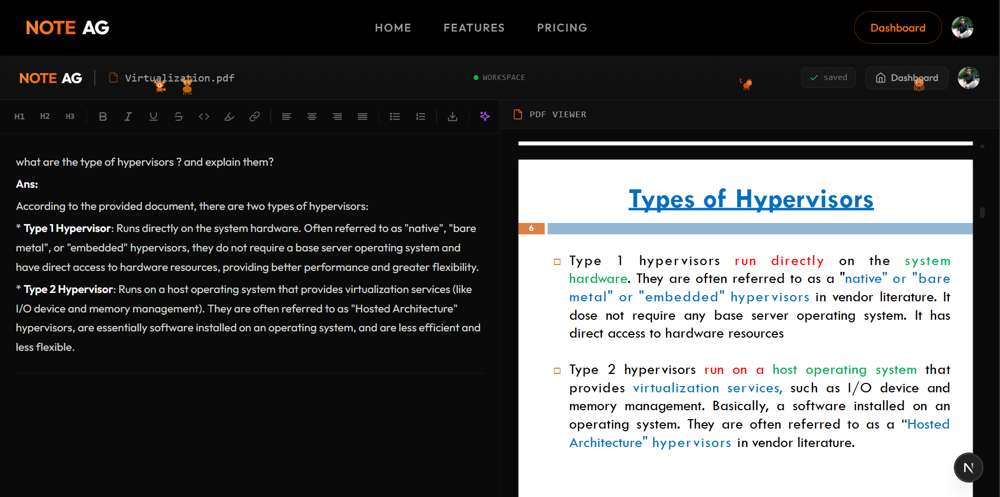

<div align="center">

# 📚 NoteAG

### AI-Powered PDF Assistant for Smarter Learning

**Upload PDFs. Ask Questions. Get Instant Answers with Source Highlighting.**

[Live Demo](#) • [Documentation](./IMPLEMENTATION_GUIDE.md) • [Report Bug](#) • [Request Feature](#)

[](https://nextjs.org/)
[](https://convex.dev/)
[](https://ai.google.dev/)
[](https://js.langchain.com/)



</div>

---

## 🚀 What is NoteAG?

**NoteAG** is an intelligent PDF assistant that helps students, researchers, and professionals extract insights from documents effortlessly. Upload any PDF, ask questions in natural language, and get accurate AI-generated answers with **exact source highlighting** in the PDF.

No more manual searching through hundreds of pages. NoteAG uses cutting-edge **RAG (Retrieval-Augmented Generation)** technology to understand your documents and provide contextual answers in seconds.

### ✨ Key Features

- 📄 **PDF Upload & Storage** - Secure cloud storage with Convex
- 🤖 **AI-Powered Q&A** - Ask questions, get intelligent answers
- 🎯 **Smart Highlighting** - See exactly where the answer comes from
- ✏️ **Built-in Text Editor** - Take notes alongside your PDF with rich text formatting
- 🔍 **Semantic Search** - Finds answers even with different wording
- 💾 **Auto-Save Notes** - Your work is always saved
- 📊 **Multi-PDF Support** - Manage multiple documents
- 💰 **Flexible Pricing** - Free tier with 5 PDFs, Pro unlimited for $4/month

---

## 🎬 How It Works


*Split-screen interface: PDF viewer on the left, AI-powered editor on the right*

### The Magic Behind NoteAG: RAG Explained

NoteAG uses **RAG (Retrieval-Augmented Generation)**, a powerful AI technique that combines search with language understanding:

#### Traditional Search ❌
```
Your question: "Where did Arijit intern?"
Document text: "...completed internship at Infosys Springboard..."
Result: NO MATCH (different words: "intern" vs "internship")
```

#### NoteAG's RAG Approach ✅
```
Your question: "Where did Arijit intern?"
  ↓
1. Converts question to meaning (vector embedding)
  ↓
2. Searches for similar meanings in PDF (not just keywords)
  ↓
3. Finds: "...completed internship at Infosys Springboard..."
  ↓
4. AI reads context and generates: "Arijit interned at Infosys Springboard"
  ↓
5. Shows answer + highlights exact source in PDF
```

**Why RAG is Better:**
- ✅ **Accurate** - Cites actual content from your PDF
- ✅ **Smart** - Understands synonyms and context
- ✅ **Transparent** - Shows exact source with highlighting
- ✅ **Fast** - Answers in ~2 seconds

---

## 🏗️ System Architecture


*Two-pipeline architecture: Upload & Embed (left) vs Query & Answer (right)*

### Pipeline 1: Upload & Embed (One-time Setup)
When you upload a PDF:
1. File stored in **Convex Storage** (cloud)
2. Text extracted from PDF using **LangChain PDFLoader**
3. Text split into **chunks** (~1000 characters each)
4. Each chunk converted to **vector embeddings** (3072 numbers capturing meaning)
5. Vectors stored in **Convex Vector Database** for fast semantic search

### Pipeline 2: Query & Answer (Real-time)
When you ask a question:
1. Question converted to vector embedding
2. **Semantic search** finds 5 most similar chunks
3. Chunks sent to **Google Gemini 2.0** with your question
4. AI generates answer with highlight phrase
5. Answer shown in editor, PDF scrolls and highlights source


*Standard LangChain data flow: Source → Load → Transform → Embed → Store → Retrieve*

---

## 🛠️ Tech Stack

| Technology | Purpose |
|-----------|---------|
| **Next.js 15** | React framework with App Router |
| **Convex** | Real-time database, file storage, vector search |
| **LangChain** | Document loading, text splitting, embeddings |
| **Google Gemini** | Vector embeddings (3072-dim) + AI generation |
| **React-PDF** | PDF rendering with text layer |
| **Tiptap** | Rich text editor for notes |
| **Clerk** | Authentication & user management |
| **Stripe** | Subscription billing |
| **Tailwind CSS** | Styling |
| **GSAP** | Smooth animations |


*Convex dashboard showing vector embeddings stored in the documents table*

---

## 🚦 Getting Started

### Prerequisites

- Node.js 18+ 
- npm/yarn/pnpm
- Google AI Studio API key ([Get it here](https://aistudio.google.com/))
- Convex account ([Sign up](https://convex.dev/))
- Clerk account ([Sign up](https://clerk.com/))

### Installation

1. **Clone the repository**
```bash
git clone https://github.com/yourusername/noteag.git
cd noteag
```

2. **Install dependencies**
```bash
npm install
```

3. **Set up Convex**
```bash
npx convex dev
```

4. **Configure environment variables**

Create `.env.local`:
```bash
# Convex
CONVEX_DEPLOYMENT=your-deployment-id
NEXT_PUBLIC_CONVEX_URL=your-convex-url

# Clerk Authentication
NEXT_PUBLIC_CLERK_PUBLISHABLE_KEY=your-clerk-pub-key
CLERK_SECRET_KEY=your-clerk-secret

# Stripe (optional)
NEXT_PUBLIC_STRIPE_PUBLIC_KEY=your-stripe-pub-key
STRIPE_SECRET_KEY=your-stripe-secret
STRIPE_WEBHOOK_SECRET=your-webhook-secret
```

Set Google API key in Convex:
```bash
npx convex env set GOOGLE_API_KEY "AIzaSy..."
```

5. **Run the development server**
```bash
npm run dev
```

Open [http://localhost:3000](http://localhost:3000) to see NoteAG in action! 🎉

---

## 📖 Usage

### 1. Upload a PDF
- Click **Dashboard** in navbar
- Click **Upload PDF** button
- Select a PDF from your computer
- Enter a custom name (optional)
- Wait for embedding process (~30 seconds)

### 2. Ask Questions
- Open your uploaded PDF from dashboard
- PDF appears on the left, text editor on the right
- Type your question in the editor
- Select the question text
- Click the **✨ AI** button in the toolbar
- Get instant answer with PDF highlighting!

### 3. Take Notes
- Use the rich text editor to take notes
- Format with headings, bold, italic, lists, etc.
- Notes auto-save to your account
- Export your work anytime

---

## 💡 Use Cases

- 📚 **Students** - Study textbooks, research papers, lecture notes
- 🔬 **Researchers** - Extract insights from academic papers
- 💼 **Professionals** - Analyze reports, contracts, documentation
- 📖 **Readers** - Understand complex books and articles
- 🎓 **Educators** - Create study materials from PDFs

---

## 🎯 Roadmap

- [ ] Multi-PDF cross-search (search across all your documents)
- [ ] Chat history and conversation threads
- [ ] Export answers as Markdown/PDF
- [ ] OCR support for scanned PDFs
- [ ] Support for Word docs, PowerPoint, websites
- [ ] Mobile app (iOS/Android)
- [ ] Collaborative workspaces
- [ ] Browser extension

---

## 🤝 Contributing

Contributions are welcome! Please feel free to submit a Pull Request.

1. Fork the project
2. Create your feature branch (`git checkout -b feature/AmazingFeature`)
3. Commit your changes (`git commit -m 'Add some AmazingFeature'`)
4. Push to the branch (`git push origin feature/AmazingFeature`)
5. Open a Pull Request

---

## 📄 License

This project is licensed under the MIT License - see the [LICENSE](LICENSE) file for details.

---

## 🙏 Acknowledgments

- [Convex](https://convex.dev/) - Amazing real-time database platform
- [LangChain](https://js.langchain.com/) - Powerful framework for LLM apps
- [Google Gemini](https://ai.google.dev/) - State-of-the-art AI models
- [Vercel](https://vercel.com/) - Seamless deployment platform

---

## 📧 Contact

**Project Maintainer** - [@yourusername](https://github.com/yourusername)

**Project Link** - [https://github.com/yourusername/noteag](https://github.com/yourusername/noteag)

---

<div align="center">

### ⭐ Star this repo if you find it helpful!

**Made with ❤️ by the NoteAG Team**

[🌐 Visit Website](#) • [📖 Read Docs] • [🐛 Report Bug](#)

</div>
